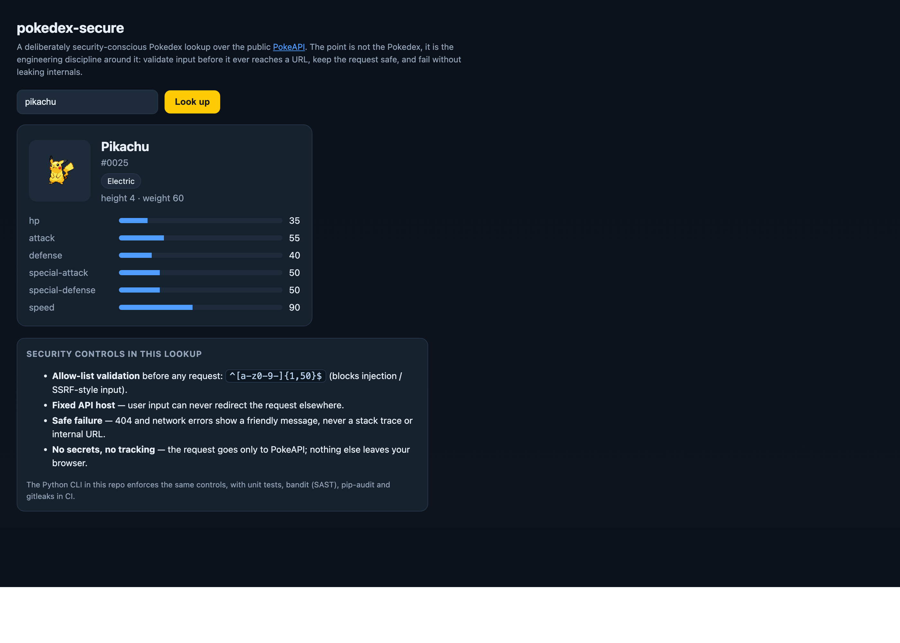

# pokedex-secure

> A tiny app built the way production code should be — secure by default.

**▶ Live demo:** https://mechmukul.github.io/pokedex-secure/ · runs in your browser. Also a Python CLI (below).



## What it is
A small Pokedex lookup over the public [PokeAPI](https://pokeapi.co). The Pokedex is just the excuse;
the real subject is **how the same feature is engineered securely** — input validation, SSRF-safe
requests, safe failure — and enforced automatically in CI.

## Why it's useful
Most "demo" code models the *insecure* default. This shows the opposite: the secure way made the easy
way, with a pipeline that fails the build on insecure code, vulnerable dependencies, or committed
secrets. It is a compact, readable reference for **secure coding + DevSecOps** habits.

## Who it's for / use cases
- **Engineers / students** wanting a concrete example of secure input handling and SSRF-safe HTTP calls.
- **Teams** wanting a minimal reference CI pipeline (SAST + dependency audit + secret scan) to copy.
- **Reviewers** who want to see security controls stated explicitly and tested, not assumed.

## Try it live (20 seconds)
1. Open the live demo (it loads Pikachu automatically).
2. Look up any Pokemon by name or id (e.g. `charizard`, `150`).
3. Try to break it — `../../etc/passwd`, `http://evil`, a long junk string — and watch the allow-list reject it *before* any request is made.

## Security controls (enforced in browser and CLI)
| Control | How |
|---|---|
| Allow-list input validation before any request | regex `^[a-z0-9-]{1,50}$` |
| SSRF-safe: fixed API host, user input can't redirect the request | hard-coded base URL |
| Request timeouts set; TLS never disabled (CLI) | `requests` with `timeout`, default verify |
| Safe failure: no stack traces or internal URLs leaked | friendly error messages only |
| No committed secrets | gitleaks in CI |
| No known-vulnerable dependencies | pip-audit in CI |
| Static analysis every push | bandit + ruff in CI |

## Run the CLI
```bash
pip install -r requirements.txt
python -m pokedex pikachu
```
Run the full check suite locally:
```bash
pip install -r requirements.txt -r requirements-dev.txt
ruff check . && pytest -q && bandit -r pokedex -ll && pip-audit -r requirements.txt
```

## Tech & quality
Python + `requests`; dependency-free browser front-end mirrors the same validation. See
[`SECURITY.md`](SECURITY.md) and `.github/workflows/security.yml`.

---
MIT licensed · Built by **Mukul Mech** · Design-level companion: [pokethreatmodel](https://github.com/mechmukul/pokethreatmodel)
